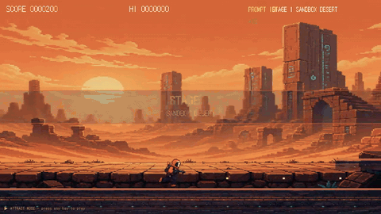
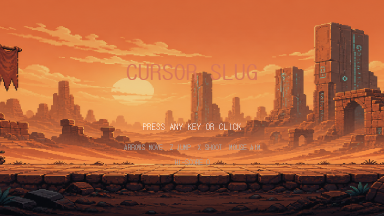
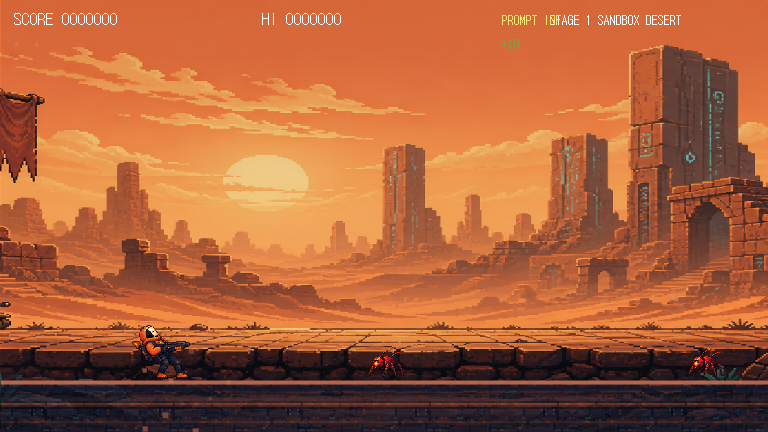
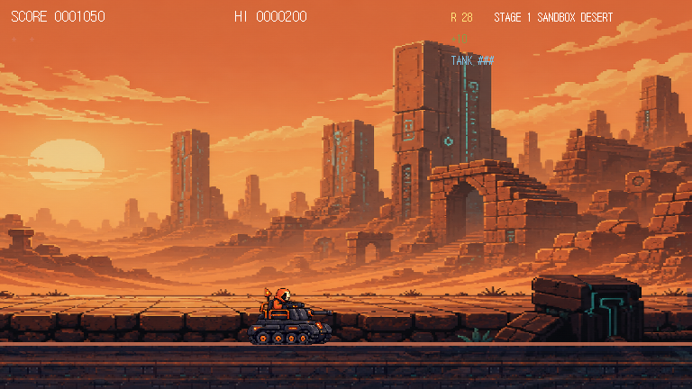
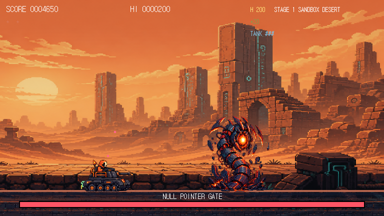

# 🐞 CURSOR SLUG

### 코드를 망치는 버그를, 코드로 쏴버리자.

`CURSOR SLUG`는 커서 오퍼레이터가 되어 화면을 점령한 버그들을 소탕하는 **Metal Slug풍 픽셀 런앤건**입니다. 사막 폐허에서 시작해 메모리 동굴과 커널 요새까지 돌파하고, `nullptr`부터 `HALLUCINATION`까지 이름만 들어도 불길한 디버깅 악몽을 정면으로 상대하세요.

<p align="center">
  <a href="https://guyster323.github.io/academy_game/">
    
  </a>
</p>

<p align="center">
  <a href="assets/trailer/cursor-slug-trailer.mp4"><b>▶ 트레일러 영상 (MP4 · 약 50초)</b></a>
  &nbsp;·&nbsp;
  <a href="https://guyster323.github.io/academy_game/?demo=1">브라우저에서 데모 자동 재생 보기</a>
</p>

> 위 영상은 게임의 **어트랙트 모드**를 그대로 녹화한 것입니다 — 3개 스테이지, 보스전, 무기 이펙트, 탱크 탑승까지 손대지 않고 흘러갑니다.

## ▶ 지금 바로 플레이하기

**다운로드도, 설치도 필요 없습니다.** 아래 링크만 클릭하면 브라우저에서 바로 게임이 시작됩니다.

### 👉 [**guyster323.github.io/academy_game**](https://guyster323.github.io/academy_game/) 👈



## 게임 한눈에 보기

- **3개 스테이지** — `SANDBOX DESERT` → `MEMORY CAVERN` → `KERNEL FORTRESS`
- **프로그래밍 밈으로 무장한 적들** — `nullptr`, `segfault`, `infloop`, `stackov`, `memleak`, `deprecated`, `racecond`
- **3종 보스전** — `NULL POINTER GATE`, `MEMORY LEAK HYDRA`, `HALLUCINATION`
- **5종 코드 무기** — 빠른 탄막부터 관통 레이저까지 상황에 맞춰 교체
- **탈것 “the slug”** — 포탄을 쏘며 전장을 밀어붙이는 탱크
- **384×216 픽셀 캔버스** — 선명한 도트 그래픽과 브라우저 합성 사운드
- **어트랙트 모드** — 주소 뒤에 `?demo=1` 을 붙이면 게임이 알아서 플레이되는 시연 모드가 돌아갑니다. 아무 키나 누르면 즉시 일반 플레이로 전환됩니다.

## 스크린샷

사막을 달리고, 무기를 줍고, 탱크에 올라타 보세요.

| 스테이지 1 · 적과의 첫 교전 | 탱크 “the slug” 탑승 |
| --- | --- |
|  |  |

| NULL POINTER GATE 보스전 | 전장의 분위기 |
| --- | --- |
|  |  |

## 왜 재밌나요?

`CURSOR SLUG`의 적들은 전부 익숙한 오류에서 태어났습니다. 가까이 붙으면 근접 공격으로 끊어내고, 멀리 있는 무리는 산탄과 로켓으로 정리하고, 빈틈을 보이는 보스의 코어에는 가장 강한 화력을 집중하세요. 적을 처치하고 포로를 구출해 점수와 보급품을 챙기며, “이번 판에는 어디까지 디버깅할 수 있을까?”를 시험하는 게임입니다.

짧은 조작 세션 안에도 픽셀 폭발, 무기 교체, 탱크 돌진, 보스 패턴 회피가 모두 들어 있습니다. 한 손은 방향키, 다른 한 손은 `X`에 올려두면 됩니다.

## 캐릭터 · 적 · 보스 도감

### 플레이어 & 탈것

- **CURSOR OPERATOR** — 커서 하나로 무장한 현장 디버거. 달리고, 점프하고, 웅크리고, 코드 조각 같은 탄환을 퍼붓습니다.
- **the slug** — 가까이 다가가면 자동으로 탑승하는 전투 탱크. 장갑으로 충돌을 버티며 포탄으로 길을 엽니다. `↓ + Z/SPACE`로 하차할 수 있습니다.

### 버그 군단

| 적 | 현장 보고서 |
| --- | --- |
| `nullptr` | 아무것도 가리키지 않지만, 이상하게 총알은 정확히 날아옵니다. 가장 먼저 만나는 기본형 버그입니다. |
| `segfault` | 보라색 사격수. 화면에 존재하는 것만으로도 런타임을 불안하게 만듭니다. |
| `infloop` | 끝없이 맴도는 부유형 버그. 움직임을 읽고 한 박자 빠르게 피하세요. |
| `stackov` | 스택을 넘치게 하며 거리를 집요하게 조절하는 돌진형. |
| `memleak` | 쓰러뜨리는 순간 둘로 갈라지는 초록색 메모리 누수입니다. |
| `deprecated` | 낡았다고 무시하면 안 됩니다. 세 갈래 탄막은 아직 현역입니다. |
| `racecond` | 타이밍이 어긋나는 순간 돌진해 오는 보라색 레이스 컨디션입니다. |

### 보스

- **NULL POINTER GATE** — 사막 관문을 지키는 첫 번째 보스. 붉은 코어가 열릴 때 공격하고, 닫힌 갑주에는 탄약을 낭비하지 마세요.
- **MEMORY LEAK HYDRA** — 세 갈래 탄환과 수직 탄막을 번갈아 쏘는 메모리 괴물. 중앙에 오래 머무를수록 위험합니다.
- **HALLUCINATION** — 본체와 분신이 뒤섞인 최종 오류. 밝은 중심체가 진짜 약점이며, 돌진이 끝난 안정화 순간이 공격 타이밍입니다.

## 무기고

전장의 크레이트와 구출 보급품에서 무기를 획득합니다. 탄약이 떨어지면 기본 무기 `PROMPT`로 돌아갑니다.

| 키 | 무기 | 한 줄 설명 |
| --- | --- | --- |
| `H` | **TOKEN STREAM** | 빠른 자동 사격. 적 무리를 코드 토큰처럼 쏟아냅니다. |
| `S` | **GREP SHOT** | 5발 산탄. 가까운 적과 좁은 틈을 한 번에 훑습니다. |
| `R` | **REFACTOR ROCKET** | 폭발 로켓. 한 발로 주변까지 크게 정리합니다. |
| `F` | **STACKTRACE FLAME** | 여러 적을 관통하는 화염. 줄지어 오는 버그에게 특히 강합니다. |
| `L` | **--verbose LASER** | 빠르고 강한 직선 관통 레이저. 보스의 약점을 정밀하게 노립니다. |

## 조작법

| 입력 | 동작 |
| --- | --- |
| `←` `→` | 이동 |
| `↑` `↓` | 위·아래 조준 / `↓`는 웅크리기 |
| `Z` / `SPACE` | 점프 · 탱크 하차(`↓`와 함께) |
| `X` / 마우스 왼쪽 | 사격 · 가까운 적은 근접 공격 |
| `C` / 마우스 오른쪽 | 수류탄 투척 |
| `R` | 게임 오버·엔딩 화면에서 재시작 |

## 실행

가장 쉬운 방법은 위의 **[지금 바로 플레이하기](https://guyster323.github.io/academy_game/)** 링크를 클릭하는 것입니다. 다운로드나 설치가 전혀 필요 없습니다.

### 파일을 직접 받아서 실행하고 싶다면

1. GitHub 저장소에서 `Code` 버튼을 누른 뒤 `Download ZIP`을 선택하고, 다운로드한 ZIP 파일의 압축을 풉니다.
2. 압축을 푼 폴더에서 `index.html` 파일을 더블클릭합니다.
3. 브라우저에 게임 화면이 열리면 바로 플레이할 수 있습니다.

### 만약 더블클릭 방식이 안 되면

저장소 폴더에서 터미널(명령 프롬프트 또는 PowerShell)을 열고 아래 명령을 실행하세요.

```
python -m http.server 8073
```

그다음 브라우저에서 `http://localhost:8073`에 접속합니다.

## 프로젝트 포인트

- 외부 라이브러리 없이 동작하는 단일 HTML5 Canvas 게임
- 픽셀 아트 스프라이트, 카메라 스크롤, 적 AI, 보스 패턴, 탱크 탑승과 무기 보급을 한 파일에 담은 작은 아케이드 실험
- 브라우저만 있으면 데스크톱에서 바로 실행할 수 있는 가벼운 플레이 경험

**이제 터미널을 닫고, 커서를 전장에 올려보세요.**
